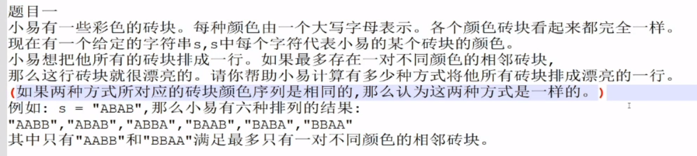
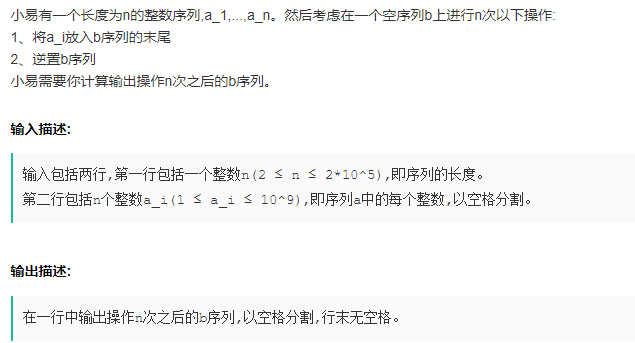
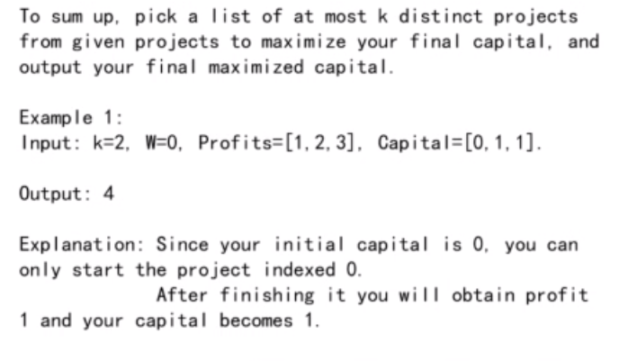

## 第一章

- 
  - 解法1
    - 定义fun(arr, i, j)为先选的最大总收益，所以要求的就是fun(arr, 0, n-1)
    - 因为A、B两人的总收益是固定的，就是i到j的和，那么确保每次自己从两个选项中选择一个，使得给另一方剩余的更少，那么说明自己得到的更多
      - 选择取**i**的值，剩下给另一方的收益即使fun(arr, i+1, j)
      - 选择取**j**的值，剩下给另一方的收益是fun(arr, i, j-1)
      - 判断fun(arr, i+1, j) 与 fun(arr, i, j-1)哪个小，就把哪个留给另一方
  - 解法2
    - 非递归
    - 求出dp[i, j]即i, j区间内先选的最大收益
  - 属于情景题，分析思路，dp完事儿
  - LeetCode预测赢家
- 
  - leetcode 最长有效括号
  - n^2级别
    - 计数当前的括号情况n，出现'('，n+1，出现')'，n-1，当n最终非0，或者期间出现负数，则匹配失败
    - 以0到n-1每个位置为开始求最大连续
  - n级别
    - 想让重用第一次遍历的结果，只遍历一遍
    - 遍历的时候，用dp[]保存每个位置为结尾的最大括号匹配长度
    - 那么匹配到下一个括号时，只需有限判断就可以知道当前位的匹配括号数
- 
  1. 遍历一遍
  2. 以每个点为结尾，求解
  3. 同2
- 
  - 主服务器每次给地区服务器分配range，而地区级服务器再从range里分配一个个id
  - java的uuid
    - 通过时间、mac等唯一确定

## 第二章

- 
  - 牛客 用递归函数和栈操作逆序栈 需要返回逆序的结果到数组中
  - 递归，每次保存栈顶元素，直到栈底，将保存的栈顶加入list中
- 
  - 就是求一个数前面哪些数比它小
  - 最一般的解法，n^2
  - 可以改写归并排序，归并时，根据情况计算
- 
  - 从0到n-1遍历一遍，统计第i位时，以i结尾的连续子数组最大值
    - 0位的最大就是arr[0]
    - i位的取决于dp[i-1]>0 ?大于的话 dp[i] = arr[i] + dp[i-1];否则dp[i] = arr[i]
- 
  - 牛客 保卫方案
  - 分析题目，两个山峰能互相看见，需要两个山峰之间所有的山峰都**不比两座山峰高**
  - 考虑每个点，左右相邻的不比它高的点，那么左右两个点就可以组成一个解
  - 可能重复的时候，会出现多个一样高的点
  - 总的来说，需要考虑每个点的相邻的不比它矮的点，在一样高的时候额外处理
  - 使用**单调栈**，求每个数的相邻的大（小）值
  - 因为山峰围成环，所以需要以最高的山峰作为单调栈的底，那么才不会出现遗漏的解

## 第三章

- 
  - LeetCode 岛屿个数
  - 普通解法
    - 挨个遍历数组，遇到一个1将1及周围的1感染成2，为一个岛
    - 遇到一个新的1则是一个新的岛，并把1及周围的1同样感染为2
  - 并行解法/**并查集**
    - 需要将表分割成多张表，分别计算每张表的岛屿个数
    - 并在和并多张表的结果时，运用**并查集**
    - 每查到一个点，假如是同一个集合，则将这个点连到**代表节点**上
- 
  - 牛客和LeetCode 弱化版题目 最近公共祖先 （**LCA算法**）
  - 并查集
    - 先序遍历
    - 两个要查询的节点一定在一棵树的左右子树
    - 当把左子树遍历结束之后
  - rmq（范围最值查询），先dp出每对节点的结果，O1时间取到结果

## 第四章

- 
  - 牛客 最大子矩形
  - 分别求以第i行为底的矩阵的最大值
    - i从1开始
    - 先求只有第1行时的最大值（即一维数组的最大子数组）
    - 再求占1、2行的矩阵的最大值，将第一行的数组和第2行的数组，按位相加，结果还是一维数组，再求最大子数组
  - 保存最大结果即可
  - 时间复杂度 n^2*m（n为宽 m为长）
  - **优化**：假如n>m 可以将矩阵旋转 算法时间复杂度变为 m^2*n
- 
  - LeetCode 盛水最多的容器（**不一样**）
  - 目的是求两个高的格子中间有多少下坳的格子（每个格子的头顶可以存多少水）
  - 两边高，求中间低，单调栈，单降
  - 中间小的数出栈时，小的数的上面就是存水的地方，结算
  - 同时需要保存中间可以存多少列水
- 
  - 没找到题目
  - 解法一
    - 从左到右遍历一遍，求得(0, 0)，(0, 1), (0, i), (0, n-1)上的最大值
    - 从右到左遍历一遍，求得(0, n-1), (1, n-1), (i, n-1), (n-1, n-1)的最大值
    - 再用i遍历一次[0, n-1]，计算以i为分割时，(0, i) 上的最大值与(i, n-1)上的最大值之和，和最大的即为结果
  - 解法二
    - 遍历一遍，求得和最小子数组（左右界分别为l, r），那么最大的不想交子数组必然是由和最小子数组分割
    - 遍历一遍，求得(0, l)上的最大值与(r, n-1)上的最大值，两最大值求和即为结果
- 
  - 牛客 左右最值最大差
  - max为整个数组的最大值，那么差值最大的情况下，一定是max减去一个最小的数
  - 而这个数最小的情况下，就是数组最右端或最左端的数
  - 所以结果为max减去arr[0]与arr[n-1]中的更小值

## 第五章

- 
  - LeetCode 最大矩形
  - 求以每行为底的矩形的最大值
- 
  - 滑动窗口
    - 保持l、r指针，并维持当前窗口的最大值和最小值
      - 当新加进来一个大值，需要更新，
      - 而当最大值出窗口时，需要知道当前窗口的次大值
      - 所以需要一个双端链表
      - 最小值同理
    - 每次移动l、r指针，
    - 当满足要求时，保存当前状态，并右移l，循环上一步；如果不满足时，右移r，循环上一步
- 
  - 牛客 链表中环的入口节点 leetcode 环形链表12 （简单版 只是求一个有环链表的入环节点）牛客 两个链表的第一个公共节点（不考虑有环）
  - map实现
  - 快慢指针
    - 找到一个有环链表的入环节点
      - 两个指针都从链表头开始，一个每次走1步，一个走两步
      - 两个指针相遇时，快指针回到head，两个指针接着遍历
      - 当两指针相遇时，就是入环节点
  - 分情况
    - 可能不相交
    - 两链表可能都无环，正常求交点
    - 可能有环
      - 那么假如一个有环一个无环，那么必定不相交
      - 都有环
        - 求两个环的入环节点是否相同，相同的话说明在入环前相交
        - 否则是在环内相交或者两个不相交
          - 如何判断呢
          - 某个入环节点遍历，假如可以遇到另一个入环节点，则环内相交，两个入环节点都是链表交点
          - 否则不相交

第六章

- 
  - 牛客 彩色砖块
  - 有一种颜色 返回1
  - 两种颜色 返回2
  - 两种以上返回0
- 
  - 牛客 等差数列
  - nlgn：排序，之后判断是否等差
  - 运用等差数列求和公式 ，遍历一遍，求得求和所需元素，判断是否相等（**不对的 可能其中两个数相同**）
- 
  - 牛客 交错01串
  - 遍历一遍，统计以每一位置开始的最长01串
  - 扩展
- 
- 

- 
- 
- 
- 
- 
- 
- 
- 
- 