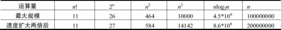

### rmq范围最值查询

- 先dp出结果集（st表 Sparse Table 稀疏表）
- 每次查询只需O1时间取出结果

### 线段树

# 算法时间估算

> 《算法竞赛入门经典》C8.1.4

- 假设机器速度是每秒$10^8$, 那么$n^2$的算法可以解决`10000`规模的问题

- 具体表

  

- 我用自己机器试了一下 运算次数大概是$4*10^8$, 所以这张表依旧是有参考意义的