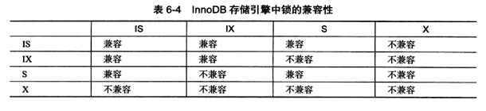
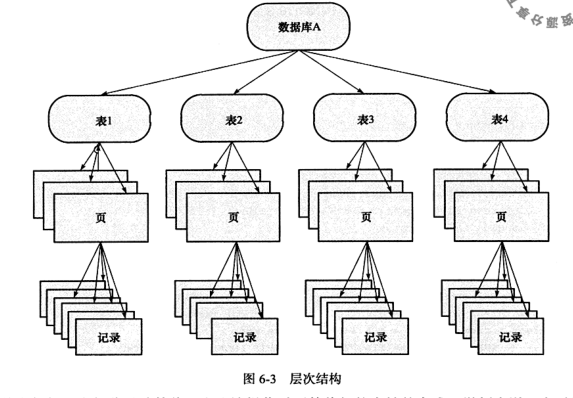

## 锁

> mysql技术内幕 6章 P249

#### 什么是锁

锁机制用于管理对共享资源的并发访问。

不同引擎（数据库）的锁：

- MyISAM表锁
- InnoDB行锁
- SQL Server页锁 性能比表锁高一点
- InnoDB和Oracle相似，支持非锁定读。行锁

### MyISAM的锁

> https://www.jianshu.com/p/d8bdecbe64ad

#### 表锁

**MyISAM只有表锁** 分两种 读锁，写锁

- 读锁不会阻塞其他线程同一表的读操作，但会阻塞同一表的写操作（**当前用户的写操作呢**）

- 写锁会阻塞其他线程同一表的读写操作 （**当前线程的读操作呢？**）

- 读写、写写操作是串行的

- 当一个线程获得对一个表的写锁后，只有持有锁的线程可以对表进行更新操作（**那写操作呢**）

- **一个线程同时只有一种操作，那么想同时读和写，只有可能”修改的语句带有子查询“ 比如：update user set name=(select name form user where id = 1) where id=2 而这个sql会报语法错误：You can't specify target table '表名' for update in FROM clause，不能以form后的表为修改目标** ， 两种解释：
  - 字面来说，查的同时，不能修改
  - 深层次来说，这样可能出现死锁（**不论MyISAM还是InnoDb都会抱这个错**）
    - MyISAM的话，因为是表锁肯定死锁
    - InnoDb的话，lock table 也一样是表锁，同样死锁

- lock table xxx read local （**只能read加local** 否则语法错误）可以实现并发插入（如果插入位置在底部，那么有一定的并发写入操作）（**然而实测不行**）

- 系统变量concurrent_insert可以配置并发插入

#### 如何加锁

- MyISAM引擎在执行select前，自动给所以涉及的表加读锁

- 在执行update、delete、insert之前会自动给涉及到的表加写锁
- lock tables table_name {read | write} 手动加锁，unlock table 手动解锁（**全部表**）；（**不论什么引擎都可以，加的表锁**）

针对**表锁**的测试

- 一个线程获得到写锁，是有select权限的。

锁调度

- 一个进程请求读锁、同时另一个线程请求写锁，**写进程先获得锁**
- 读请求先到达等待队列，写请求后到达，**写进程也先获得锁**
- 因为MyISAM认为写请求一般比读请求重要
- 可以通过一些设置调节MyISAM的调度行为

### InnoDb锁

InnoDb会在共享资源的并发访问时使用锁：

- 行锁
- 操作缓冲池中的LRU缓存列表需要并发访问

#### lock和latch

##### latch

一般称闩锁（轻量锁），要求锁定时间必须非常短，否则性能会很差。

latch分为：

- mutex互斥锁
- rwlock读写锁

特点：

- 用来保证并发线程操作临界资源的正确性
- 并且通常**没有检测死锁的机制**

##### lock

- lock的对象是事务，用来锁定数据库中的对象：表、页、行
- 一般lock对象仅在事务commit或rollback后释放（隔离级别不同而不同）
- 有死锁检测机制

主要讨论的是lock

#### 索类型

两种行级锁：

- 共享锁(S lock)：允许事务读取一行数据
- 排他锁(X lock)：允许事务删除或更新一行数据

#### 锁兼容

- 锁兼容：事务T1已经获得了行r的共享锁，那么事务T2可以立刻获得行r的共享锁
- 锁不兼容：若此时有事务T3需要获得行r的排他锁，那么必须等待T1，T2释放行r的共享锁

- 只有共享锁之间兼容
- 排他锁与所有锁不兼容

#### 多粒度锁定

- InnoDB支持多粒度锁定这种锁定允许事务在行级上锁和表级上的锁同事存在。
- 为了支持不同粒度上的加锁操作，InnoDB支持一种额外加锁方式：**意向锁**
- 意向锁（表级）：
  - 意味着事务希望在更细粒度上进行加锁
  - 分类
    - 意向共享锁 IS锁：事务想要获取一张表的某几行的共享锁
    - 意向排他锁 IX锁：事务想要获得一张表的某几行的排他锁
  - 兼容性：
    - 意向锁之间兼容
    - IX锁与S、X不兼容
    - IS锁与S锁兼容、与X锁不兼容
  - 将上锁对象看成一棵树：
  - 想对记录上X锁时，需要**分别对数据库、表、页上意向锁IX**，最后对记录上X锁
  - 若其中任何一部分导致等待，那么该操作需要等待粗粒度锁的完成
    - 若表已存在S锁，IX锁和S锁不兼容。所以需要等待S锁的释放

#### SQL加锁

##### MyISAM

- 自动加锁：“MyISAM的锁”部分有介绍
- 手动加锁：“MyISAM的锁”部分有介绍

##### InnoDB

- 自动加锁：
  - 修改时，自动加行X锁
  - **但是select时，却不会自动加行S锁**
    - **读取的是快照——MVCC** 见下文 "一致性非锁定读"
- 手动加锁：
  - select * from xx lock in share mode 加S锁
  - select * from xx for update 加X锁
  - 这两个的锁在事务完成时，释放

#### 查看锁/事务状态

- show engine innodb status;
- select * from information_schema.innodb_trx;

#### 一致性非锁定读/MVCC

##### 原理

- 一致性非锁定读是指：InnoDB通过多版本并发控制（Multi-version concurrency control MVCC）的方式来读取当前执行时间数据库中行的数据；

- 如果读取的行正在执行delete或update操作，这时候读取数据不会因此等待行上的锁释放。而是读取行的一个快照数据

- 快照数据是该行之前版本的数据，通过undo段实现
- 而undo段用来事务回滚，所以快照数据本身没有额外开销
- 快照数据不需要上锁，因为事务不会修改历史数据
- 一个行记录可能不止一个快照数据，所以叫多版本并发控制
- 不同事务隔离级别下，数据读取方式不同，可能不使用MVCC
  - Read Committed 下读取被锁定行的最新一份快照数据（所以，另一个事务提交之后，当前事务可以看到）
  - Repeatable Read 下读取被锁定行读取事务最开始时的行数据版本（假如当前事务第二次读取时，修改行数据的事务提交了， 那么**还会保留修改之前的undo日志吗**）
  - 其他的隔离级别
    - Read Uncommitted 还未提交的就可以读，也就是不需要任何同步措施，直接拿到当前行的数据就够了（假如是MVCC的话，需要判断查出的结果是否对当前事务可见，不可见时，查询快照数据）
    - Serlaizable 针对同一行数据：一个事务做完才开始做下一个事务，期间阻塞

#### 自增长与锁

含有自增值得表，每次插入操作需要保证自增值的正确获得

##### InnoDB有两种实现：

- auto-inc locking ：每张表都有自增计数器，插入操作会依据自增计数器加1赋值给自增列，
  - 并发的情况下需要给自增计数器加锁，这种锁采用的是一种特殊的**表锁**（所以性能很差，每次插入时需要表X锁）
  - 为了提高性能，锁不是在事务完成后释放，而是在完成**自增值插入的sql语句**后立刻释放。
  - 性能差：
    - 需要等待前一个插入语句的完成
    - insert ……select的大量数据插入会影响性能
      - 因为另一个事务的插入会被阻塞
      - **那么 select不会阻塞吗？**
- 互斥量：使用**互斥量**对**内存中的计数器**进行累加操作
  - 仅对simple inserts安全
  - 复杂插入可能出现问题
- 可以通过配置InnoDB_autoinc_lock_mode选择如何使用这两种实现
  - 0 ：全部插入使用auto-inc locking
  - 1：simple inserts 选择互斥量，其他依然用auto-inc locking
  - 2：全部插入使用互斥量

- InnoDB中自增值的列，必须是索引且是索引的第一列，否则会抛异常（不知道为什么）

##### MyISAM实现：

MyISAM是表锁机制，自增值插入时不需要考虑并发插入问题（整个表被当前线程独占，当然不用考虑）

#### 外键与锁

- **外键所在的表B需要依赖A表的主键**，假如B表插入的过程中所依赖的**A中的主键正在被另一个事务删除**，那么此时不能使用MVCC
- 例如：insert into B (name, role) values ('dsf', 10) ，与此同时另一事务正在删除A表中的10主键的记录：delete from A where role = 10
- 此时假如使用**MVCC的话会发现记录10存在A表**，插入成功之后，另一**事务将10记录从A删除**，那么就会产生数据不一致
- 所以，当**外键修改**时，查询所依赖的表中是否存在依赖的主键时，不能普通的select（因为会取到快照数据），而是应该select lock in share mode 加S锁

### 锁的问题

- 丢失更新
  - 事务A修改行R，事务A未提交时，事务B也修改了行R，事务A看不到自己的修改，直接看到了事务B的修改
  - 所有事务隔离级别都不会出现这种问题：修改行R需要加X锁，直到事务提交才会释放，期间B无法更新R

- 脏读
  - A事务读到了B事务未提交的修改
  - 出现这个问题的隔离级别是：未提交读
  - 以**提交读和可重复读**通过MVCC或加S锁都可以实现
  - **可重复读**还可以通过**nextkey lock**实现

- 不可重复读
  - 事务A以同样的条件查询两次，查到的结果不同
  - 可重复读更倾向于指个别条数据的修改（查询语句为等值查询而不是范围查询）：
    - 事务A查询行R数据
    - 同时事务B修改行R并提交
    - 事务A重新查询行R，发现被修改
  - 可以通过加record lock锁单行记录可以实现
  - 出现这个问题的隔离级别是已提交读
- 幻读
  - 与不可重复读相似，也是两次查询结果不同
  - 不同点在于：幻读倾向于指数据量改变：第一次查询（**范围查询或者非唯一索引查询**）到n条数据，而第二次查到的结果却不是n条，一般是数据变多了
    - 可重复读将记录加锁，可以避免记录被修改**删除**（可以吗）
    - 但是却不能保证有**新的符合条件的记录被另一事务插入**
  - 可以通过nextkey lock实现锁定范围，范围内不允许插入新的记录
  - InnoDB的可重复读可以**同时解决不可重复读和幻读**

### 锁的算法

#### 行锁的3种算法

- Record Lock：单个行记录上的锁
  - 总是会去锁住**索引记录**（**哪个索引**），如果**InnoDB存储引擎表在建立时没有设置任何一个索引**（这么说 前面的索引是需要设置的？），那么这时InnoDB会使用隐式主键来进行锁定
  - 总会锁定当前where条件中的包含的索引
    - 假如where条件不包含索引，锁定主键
    - where包含一个索引时，锁定索引(因为不一定唯一索引，可能要锁定多个值——非唯一索引的实现是通过溢出页，类似hash冲突时拉链，所以只能**先锁索引**，再由**索引中的主键再锁聚簇索引**， 假如有锁同一索引的在索引处就会阻塞)
    - 假如where条件包含**多个索引**时：
      - 多个索引中没主键的情况下：**锁定最早创建的索引**，（sql语句定义索引的顺序）（这样尽可能地再索引上就发现冲突：比如创建时间先后为1，2，3，所有包含索引1的查询都会锁定索引1）
      - 多个索引中有主键时**锁主键**，为什么呢（因为主键唯一，已经明确了要锁的行，假如锁索引，可能会额外锁多条数据）
- Gap Lock：间隙锁：锁定一个范围，但不包含记录本身
  - 锁定时，间隙中不可被**修改**（**可否删除、修改、查询？**）
- Next-Key Lock ：Gap lock + record lock 锁定范围且锁定记录本身
  - InnoDB对行的查询都是采用这种锁定算法
  - 例如一个索引有10、11、13、20四个值，那么该索引可能被Next-Key Locking 的区间为：
    - (-&infin;, 10]
    - (10, 11]
    - (11, 13]
    - (20, +&infin;)
  - Next-key lock的设计目的是为了解决幻读（具体看下一节）
  - 除了next-key lock还有previous-key lock，next是前开后闭，previous是前闭后开
  - 如果next-key lock下，已锁定 (10, 11]、(11, 13]，那么插入12，则锁定区域会变成(10, 11]、(11, 12]、(12, 13]，**闭区间的的界限比如插入前的11、13和新插入的12等是具体存在的记录，是record lock，而中间的间隙则是gap lock**
  - 而当查询的索引含有唯一属性时（**也就是唯一索引？唯一属性的意思是：必须可以锁定到具体某行——唯一索引的等值匹配，不能是范围查询或非唯一索引的等值匹配**），InnoDB会**对Next-key lock优化**，降级成为**record lock**；（因为这个时候，可能匹配到的结果已经固定，不可能插入一条符合条件的行，所以只锁定当前行就可以）

#### 幻读问题

- InnoDB的默认的隔离级别（可重复读repeatable read）下，使用next-key locking解决幻读问题
- 而其他数据库可能需要在serializable的级别下才可以解决幻读

#### 插入时加锁

- 插入之前会加**插入意向锁**
  - 插入意向锁**不是真的意向锁**（意向锁是表锁），而是**gap lock**，锁一个范围（和上面讲的一样，加在记录之间，**锁不存在的数据**）是**行锁**
  - **与gap锁不同**的是，**gap lock 锁的范围重复**是会**冲突**的，而插入意向锁不会冲突，**除非插入的行是同一行**
- 插入完成之后，会在**刚插入的那行上加行X锁**

### 阻塞

- 某事务的想要加锁时，需要等待其他事务释放不兼容的锁
- **阻塞时间**：设置**innodb_lock_wait_timeout**控制阻塞时间（**默认50s**）**innodb_rollback_on_timeout配置超时是否回滚（默认不回滚）**

### 死锁

#### 死锁概念

- 两个或以上事务在执行过程中，因争夺锁资源而造成互相等待
- 解决死锁的方法：
  - 超时：当两个事务互相等待时，当一个等待超时，其中一个事务回滚，另一个事务就可以正常执行。
  - 死锁检测：wait-for graph
    - wait-for graph保存两种信息：
      - 锁的信息链表
      - 事务等待链表
    - 上述链表构造一张图，假如存在回路，则代表存在死锁
      - 检查方式：深度优先搜索
      - InnoDB 1.2以前递归实现，1.2开始变为非递归实现

#### 死锁概率

概率很低  P280

### 锁升级

- 锁升级指锁的粒度降低（锁的范围扩大）
- 例如：数据库可以把一个表的1000个行锁升级为一个页锁
- 如果数据库设计中认为锁是稀有资源，而且想避免锁开销，那么就会频繁出现锁升级
  - 例如sql server：可以在适当的时候，自动地将行、键或分页锁升级为更粗粒度的表锁。可以保护系统资源，防止系统用太多内存维护锁，提高了效率
  - sql server在以下情况下可能出现锁升级：
    - 一个单独的sql在一个对象上持有的锁数量超过了阈值（默认5000）
    - 锁资源占用的内存超过了激活内存的40%
- 锁升级可以带来一定的效率提高，但也会**因为锁粒度降低而导致并发性能变差**
- InnoDB不存在锁升级问题：
  - InnoDB锁记录按**每个事务访问的每个页**存储：每个事务包含的不同页的锁，同一页的锁状态存放在同一张位图上，事务A可能访问了1-10这10个页，那么**只需要为每页保存一个位图共10张位图**就好，**锁数量的多少对InnoDB没有区别**
  - 而且位图存储**节省空间**