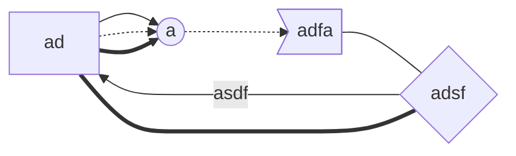
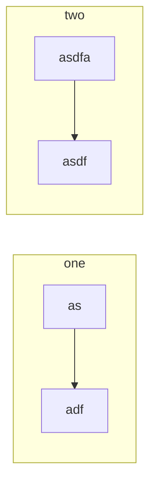
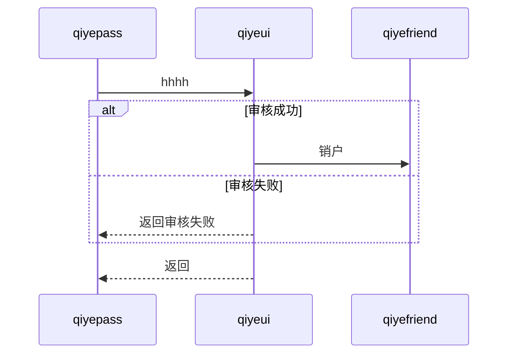
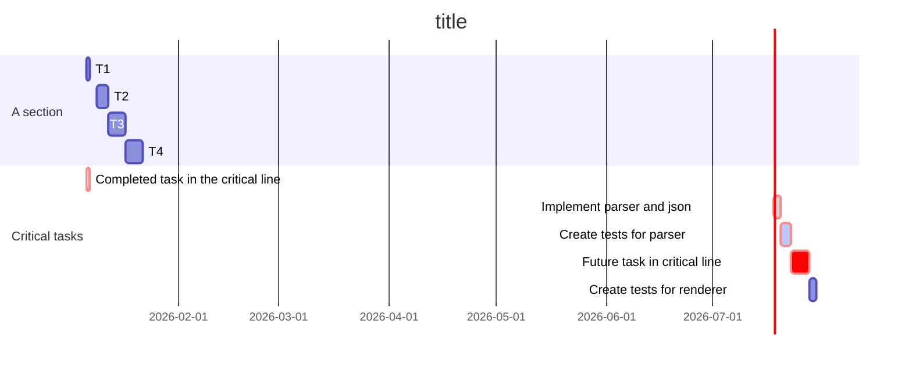

- 流程图

```mermaid
graph LR

A --> B
A[ad] -.-> B(AB)
A ==> B
B((a)) -.-> C>adfa]
C --- D{adsf}
D -- asdf --> A
D === A
```

子图

```mermaid
graph LR
subgraph one
	as --> adf
end
subgraph two
	asdfa --> asdf
end
```

- graph LR\RL\TB\BT

- 时序图

```mermaid
sequenceDiagram

qiyepass ->> qiyeui : hhhh
alt 审核成功 
	qiyeui ->> qiyefriend : 销户
else 审核失败
	qiyeui -->> qiyepass : 返回审核失败
end
qiyeui -->> qiyepass : 返回


```

- 甘特图

```mermaid
gantt
dateFormat　MM-DD

　　　title title
　　　section A section
　　　T1　: 01-06,1d
　　　T2 　: 01-09, 3d
　　　T3 : 5d
　　　T4　: 5d
　　　section Critical tasks
　　　Completed task in the critical line　:crit, done, 01-06,24h
　　　Implement parser and json　　　　　　:crit, done, after des1, 2d
　　　Create tests for parser　　　　　　　:crit, active, 3d
　　　Future task in critical line　　　　　:crit, 5d
　　　Create tests for renderer　　　　　　:2d
```

