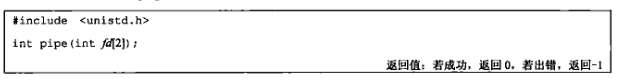
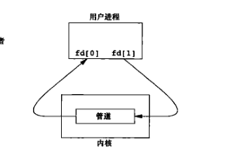
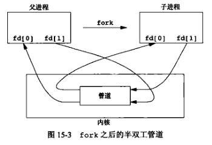
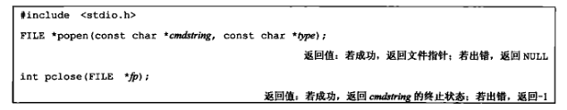
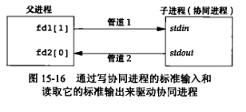
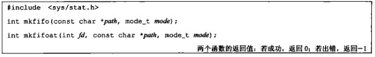

## 进程、线程、协程

### 协程

用户级线程，需要程序员自己实现线程调度

## 进程间通信

### 管道

- 局限性
  - 半双工（同时**只能单向流动**）
  - 只能在具有**公共祖先**的两个进程之间使用（fifo没有这种局限）

- 每当在管道中键入一个命令序列，让shell执行时，shell都会为每条命令单独创建一个进程，然而用管道将前一条命令进程的标准输出与后一条命令的标准输入相连接

- 管道通过pipe函数创建

  - fd中返回两个文件描述符 **fd[0]为读而打开**，**fd[1]为写而打开**
  - fd[1]的输出是fd[0]的输入
  - 
  - fd[1]向管道写入，fd[0]从管道中读出

- 通常进程会先**调用pipe**，接着**调用fork**创建子进程（与父进程共用管道），从而创建父进程与子进程的IPC通道

   

  - fork之后做什么取决于我们想要的数据流方向
    - 父进程关闭fd[0]、子进程关闭fd[1]，成为从父进程流向子进程的管道
    - 反正亦然

- 管道使用规则

  - 当读一个写端被关闭的管道时，在所有数据被读取后，read返回0，标识文件结束
    - 假如写端还有进程就不会产生文件结束
    - 可以多进程操作管道，但无名管道一般只有一个读进程和一个写进程
    - fifo常常有多个写进程
  - 当写一个读端已关闭的管道，则产生信号sigpipe，如果该信号从write返回，write返回-1，error被置为epipe
    - 在写时，如果写入的字节数小于等于pipe_buf（管道缓冲区大小），则此操作不会与其他进程的write操作交叉进行
    - 如果超过了pipe_buf，那么久可能与其他进程所写数据交叉
    - 原因：内核每次最多写入pipe_buf大小数据，这是原子操作，所以小于pipe_buf不会交叉

### popen和pclose

可以用popen打开一个与指定命令进程的单向的管道，pclose配套关闭管道

实现

- popen
  - 创建一个管道，fork一个子进程，关闭未使用管道端
  - 子进程调用exec执行**cmdString**
    - type为'r'：返回文件指针指向cmdString进程的输出，父进程（当前调用popen的进程）可以从返回文件指针中读出cmd的输出
    - type为'w'：返回文件指针指向cmdString进程的输入，父进程可以写入cmd的输入
- pclose关闭io流，等待命令终止，返回shell终止状态

优点：减少了代码量

### 协同进程

#### 定义

- **过滤程序**：过滤程序**从标准输入读取数据**，**向标准输出写数据**
- 几个过滤程序在shell管道中线性连接，当一个过滤器A既产生过滤程序B的输入，又读取B的输出，此时**B是协同进程**

#### 实现

- 打开两个管道，fork一个子进程

### FIFO

FIFO又称有名管道

- 无名管道只能在有公共祖先的进程之间使用，有名管道可以在不相干进程间通信
- 创建方法
  - 

