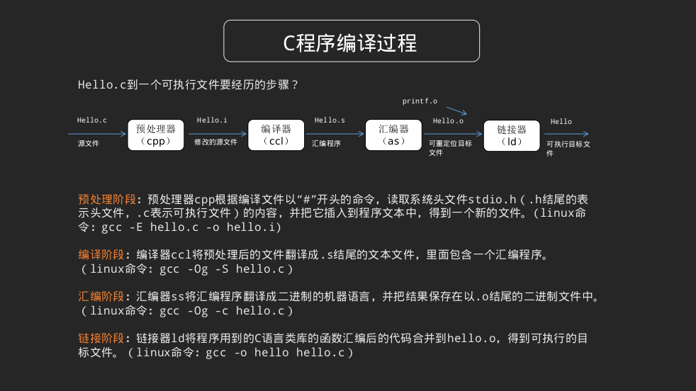
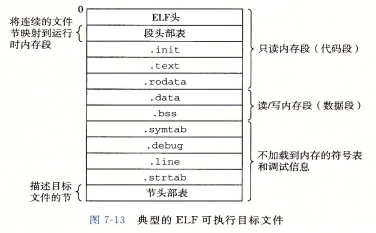

## 程序与进程

### c语言角度

> https://www.cnblogs.com/yweihum/p/9541380.html
>
> 博文表示参见《深入理解计算机系统》但没说哪个单元

- 程序是指令和数据的集合，可以作为目标文件保存在磁盘中，或者作为段存放在内存地址空间中
- 进程是程序运行的一个具体实例，程序总是运行在某个进程的上下文中

#### c程序到可执行程序

- c语言程序需要经过 **预处理、编译器、汇编器、链接器**才可以生成一个可执行程序

- 可执行文件存储格式

  

#### 可执行文件的执行过程

- shell执行./hello时，认为shell是一个可执行文件，于是调用驻留在存储器的叫加载器(loader)的操作系统代码来运行它
- 加载器将可执行目标文件的代码和数据从磁盘读到内存
- 然后通过跳转到程序的第一条指令或入口点来运行程序

- shell执行一个程序时，父shell进程fork一个子进程
- 子进程调用execve系统调用调用加载器
- 加载器删除子进程的虚拟内存段，并创建新的代码、数据、堆、和栈段
- 通过将虚拟地址的页地址映射到内存中可执行文件的页地址来初始化可执行文件的内容。
- 最后加载器跳转到_start地址，调用程序的main函数

### 操作系统角度

> https://www.cnblogs.com/enochzzg/p/9644089.html

- 进程定义
  - 进程是程序在某个数据集合上的运行过程
  - 进程由正文段、用户数据段、进程控制块组成的执行环境
    - 正文段存放被执行的机器指令
    - 用户数据段存放进程在执行时直接进行操作的用户数据
    - 进程控制块存放程序的运行环境，操作系统通过这些数据描述和管理进程
- 进程特征
  - 并发性
    - 多个实体能在一段时间间隔内同时运行
  - 动态性
    - 进程是进程实体的执行过程
      - 因执行程序而创建进程
      - 因获得cpu而执行进程指令
      - 因运行终止而被撤销
  - 独立性
    - 在没有引入线程概念的操作系统中，进程是独立运行和资源调度的基本单位
  - 异步性
    - 进程执行时断时续，进程什么时候执行、什么时候暂停都无法预知，呈现出一种随机的特性
  - 结构特征
    - 进程包括正文段、用户数据段、进程控制段
- 与程序的区别
  - 程序是静态的，进程是动态的
  - 程序是存储在某种介质上的二进制代码，进程对应了程序的执行过程
  - 程序不一定执行，所以不一定对应一个进程
  - 但一个程序也可以对应多个进程，由多个进程同时执行