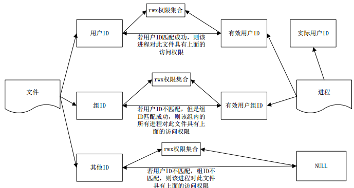

# 设置用户/setuid /chmod u+s

> https://blog.csdn.net/taiyang1987912/article/details/40651623 基本概念/getuid/geteuid及示例
>
> https://www.cnblogs.com/stemon/p/5287631.html 图片出处/用户id的初始化及改变的方式/用户-文件权限判断方式

### 用户id有三个概念

- uid/ruid 真实用户id
- euid 有效用户id
- suid : saved uid 保存的设置用户id

- 进程执行时(exec)
  - 假如可执行文件设置了"设置用户id位"(chmod u+s) 那么有效用户id会变成可执行文件所有者id
  - 否则有效用户id为实际用户id
  - **保存用户id总是复制的有效用户id**
  - 真实用户id总为进程所有者用户id
  - 设置用户id位并不会改变uid, suid值, 即使是root用户
- setuid(uid)
  - 当前用户是普通用户
    - 只有传入参数是当前的uid, euid, suid中的某一个时, 才起作用
    - 此时只有euid被改变为传入参数
  - 当前用户为root时
    - ruid, euid, suid都会变成传入的参数
  - 普通用户setuid之后还可以恢复成之前的euid, 因为suid复制自之前的euid
  - 而当root用户setuid之后, 会完全变成普通用户(前提setuid的参数是普通用户id)
    - 为了解决这个问题, 有一个seteuid函数
- seteuid
  - 设置有效用户id
  - 普通用户只能设置为 uid, euid, suid中的值
  - root可以设置为任意非负数

### 文件和进程的权限对应关系

### chmod命令

> https://www.cnblogs.com/zjutzz/p/4229856.html chmod g+s o+t u+s
>
> https://www.cnblogs.com/MrListening/p/5813281.html sticky bit

- chmod u+s设置用户id位
  - 设置成功时, ll命令显示用户权限rwx那组的x位变为s
  - 假如有x权限, 则小写
  - 否则大写
- chmod g+s / setgid 设置用户组id位
  - 只对目录起作用
  - 任何用户在此目录下创建文件都具有和该目录所属组相同的组
  - 设置成功时, ll命令显示用户组权限rwx那组的x位变为s
  - 假如有x权限, 则小写
  - 否则大写
- chmod o+t
  - sticky位
  - 只对目录起作用t
  - 防删位, 假如一个目录设置了粘滞位, 那么即使其他用户有写权限, 可以新建文件, 但无法删除文件
    - root除外
  - 设置成功时, ll命令显示其他用户权限rwx那组的x位变为t
  - 假如有x权限, 则小写
  - 否则大写
- 文件权限以8进制显示共4位, 在三组rwx之前, 第1位为setuid, setgid, sticky表示
  - setuid权重为4
  - setgid为2
  - sticky为1
  - 所以4xxx表示设置了用户id位的文件