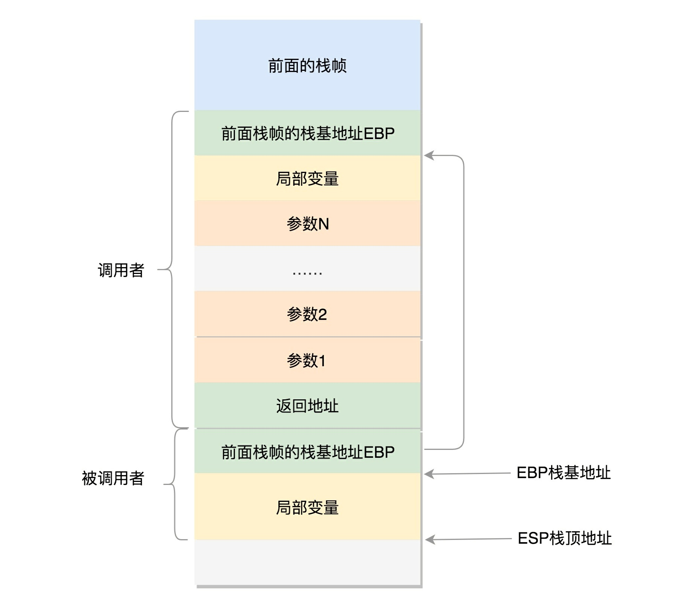

在程序执行过程中，一旦调用到系统调用，就需要进入内核继续执行。那如何将用户态和内核态的执行串起来呢？

这就需要以下两个重要的成员变量：

```c
struct thread_info thread_info;
void *stack;
```

# 用户态函数栈

- 在用户态，程序的执行往往是一个函数调用另一个函数。函数调用都是通过栈来进行的。

- 函数调用其实也很简单，其实就是指令跳转，从代码的一个地方跳到另一个地方。

- 但是参数和返回地址该怎么传递过去呢？

- 我们看到函数的调用过程：A调用B、调用C、调用D，然后返回C、返回B、返回A，这是一个后进先出的过程。所以用栈来保存这些最合适。
- 在进程的内存空间里，栈是一个从高地址到低地址，从上往下增长的结构，也就是上面是栈底，下面是栈顶，入栈和出栈操作都是从下面的栈顶开始的。

## 32位系统



- 在CPU里，`ESP`（Extended Stack Pointer）是栈顶指针寄存器，入栈操作push和出栈操作pop指令，会自动调整ESP的值。
- 另外有一个寄存器`EBP`（Extended Base Pointer），是栈基地址指针寄存器，指向当前栈帧的最底部。
  - 例如：A调用B，A的栈里包含
    - A函数的局部变量，
    - 然后是调用B的时候要传给它的参数
    - 返回A的地址，这个地址也应该入栈
    - 这就形成了A的栈帧。
  - B的栈帧部分：
    - 先保存的是A栈帧的栈底位置，也就是`EBP`（上一个栈帧的栈基地址），因为B函数里面获取A传进来的参数，就是通过这个指针获取的
    - 接下来保存的是B的局部变量等等
  - 当B返回的时候，返回值会保存在`EAX`寄存器中，从栈中弹出返回地址，将指令跳转出去，参数也从栈中弹出，然后继续执行A

## 64位系统

因为64位操作系统的寄存器数目比较多。

- `rax`用于保存函数调用的返回结果
- `rsp`用于保存栈顶指针，指向栈顶位置，出栈和入栈操作会自动调整`rsp`
- `rbp`用于保存栈基指针，指向当前栈帧的起始位置？？

